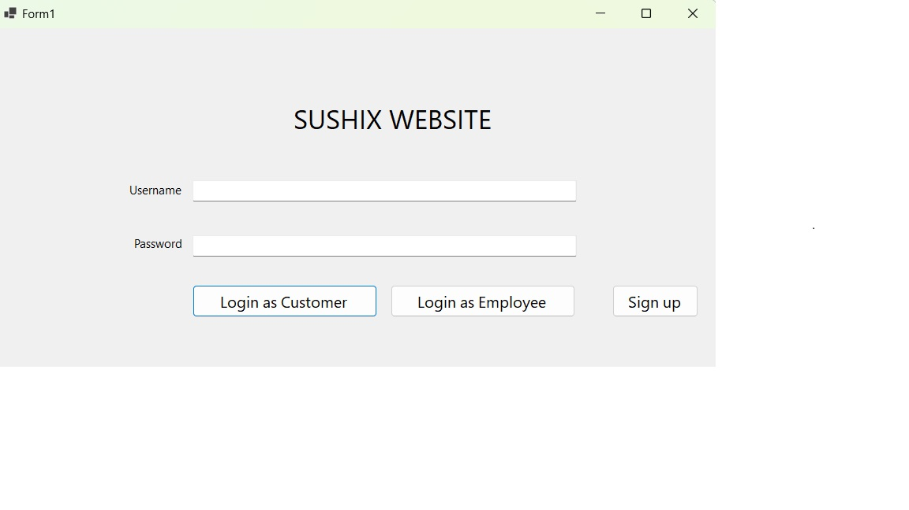

# Sushi Restaurant Management System 🍣  
A Windows Forms application for managing sushi restaurant operations, including order processing, customer membership, and revenue tracking.


## Screenshots  
  


## Technologies Used  
- **Programming Language:** C#  
- **Database:** SQL Server  
- **Tools & Frameworks:** WinForms, ADO.NET, Stored Procedures, Triggers, Indexing  
- **Database Design:** ERD, Normalization (3NF), Indexing & Partitioning Optimization

  
## Technologies Used  
- **Programming Language:** C#  
- **Database:** SQL Server  
- **Tools & Frameworks:** WinForms, ADO.NET, Stored Procedures, Triggers, Indexing  
- **Database Design:** ERD, Normalization (3NF), Indexing & Partitioning Optimization  


## How to Run  
1. Clone the repository:  
   ```bash
   git clone https://github.com/Pearsooon/Sushi-Restaurant-Management.git
2. Open the project in Visual Studio.
3. Restore NuGet packages if necessary.
4. Import the database script into SQL Server.
5. Run the application.


#### ✅ **Features**  
```md
## Features  
✔️ Customer & Employee Management  
✔️ Order Processing & Payment  
✔️ Membership Program (Membership, Silver, Gold)  
✔️ Database Optimization with Indexing & Partitioning
✔️ A WinForm Application to manage the system

## Contact  
📧 Email: hoangson14112004@gmail.com
